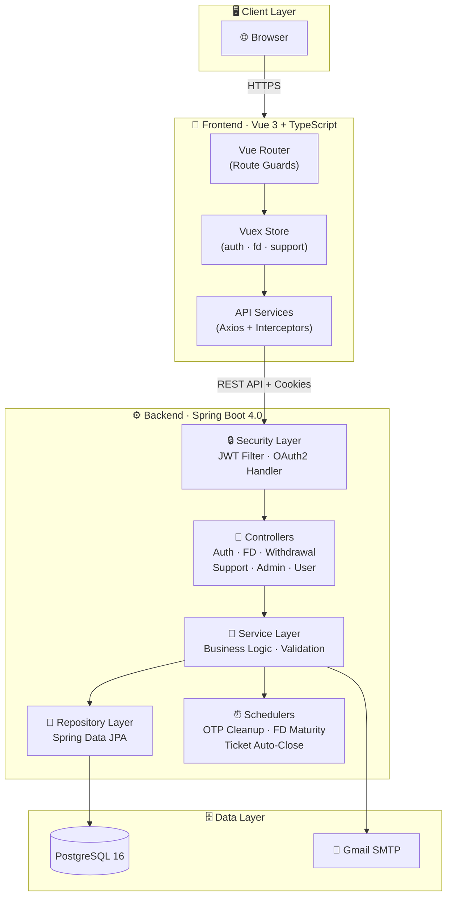
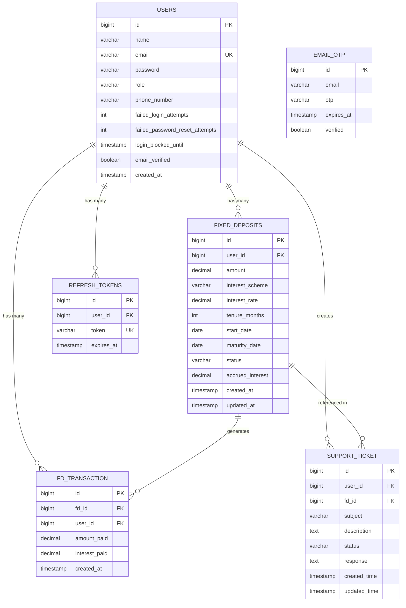

<h1 align="center">Digital Fixed Deposit System</h1>

<p align="center">
  <strong>A modern, enterprise-grade banking platform for managing Fixed Deposits — from booking to maturity, withdrawal to analytics.</strong>
</p>

<p align="center">
  <a href="#-quick-start"></a>
  <a href="#-api-reference"></a>
  <a href="#-contributors"></a>
</p>

<p align="center">
  
  
  
  
  
  
  
  
</p>

<p align="center">
  
  
  
</p>

---

<br/>

## 📖 Table of Contents

<table>
<tr>
<td width="50%">

### Getting Started
- [Overview](#-overview)
- [Quick Start](#-quick-start)
- [Prerequisites](#-prerequisites)
- [Installation](#-installation--setup)
- [Docker Deployment](#-docker-deployment)

### Architecture
- [System Architecture](#-system-architecture)
- [Project Structure](#-project-structure)
- [Database Design](#-database-design)

</td>
<td width="50%">

### Features & API
- [Key Features](#-key-features)
- [API Reference](#-api-reference)
- [FD Schemes](#-fd-schemes)
- [Security](#-security)

### Project Info
- [Tech Stack](#-tech-stack)
- [Testing](#-testing)
- [Contributors](#-contributors)
- [Roadmap](#-roadmap)

</td>
</tr>
</table>

---

<br/>

## 🌟 Overview

<table>
<tr>
<td>

The **Digital Fixed Deposit System** transforms traditional fixed deposit management into a seamless digital experience. Built with a modern microservice-inspired architecture, it offers secure role-based operations for customers and administrators with real-time analytics, automated maturity processing, and an integrated support system.

</td>
</tr>
</table>

<br/>

<table>
<tr>
<td align="center" width="25%">
  <br/>
  <strong>Secure Auth</strong><br/>
  <sub>JWT + OAuth2 + OTP<br/>with cookie-based sessions</sub>
</td>
<td align="center" width="25%">
  <br/>
  <strong>FD Lifecycle</strong><br/>
  <sub>Book → Track → Mature<br/>→ Withdraw → Close</sub>
</td>
<td align="center" width="25%">
  <br/>
  <strong>Analytics</strong><br/>
  <sub>Portfolio overview, interest<br/>timelines & FY summaries</sub>
</td>
<td align="center" width="25%">
  <br/>
  <strong>Automation</strong><br/>
  <sub>Scheduled maturity, OTP<br/>cleanup & ticket closure</sub>
</td>
</tr>
</table>

---

<br/>

## ✨ Key Features

<details>
<summary><strong>👤 User Features</strong> — Click to expand</summary>
<br/>

| Category | Features |
|:---------|:---------|
| **🔐 Authentication** | Email registration with OTP · Secure login with lockout protection · JWT tokens in HTTP-only cookies · Refresh token rotation · Password reset via OTP · Google OAuth2 sign-in |
| **💰 Fixed Deposits** | Browse FD schemes · Book new FDs · View & filter FDs by status/amount · Track maturity dates · Interest accrual timeline · Financial year summaries · Portfolio aggregation |
| **🏧 Withdrawals** | Eligibility checks · Break preview with penalty · Partial/full withdrawal · Transaction receipts · Withdrawal history |
| **🎫 Support** | Create tickets linked to FDs · Track ticket status · View admin responses · Ticket history |
| **👤 Profile** | View & edit profile · Change password · Account security |

</details>

<details>
<summary><strong>🛡️ Admin Features</strong> — Click to expand</summary>
<br/>

| Category | Features |
|:---------|:---------|
| **📊 FD Management** | View all FDs system-wide · Filter by status/amount/user · Manual status updates · Maturing FD monitoring · User portfolio access · Financial year reports · Interest timelines |
| **🎫 Support Ops** | View all tickets (filtered + paginated) · Respond to tickets · Status transitions (Open → In Progress → Resolved → Closed) · Auto-close resolved tickets after 7 days |

</details>

<details>
<summary><strong>⚙️ System Features</strong> — Click to expand</summary>
<br/>

| Scheduler | Frequency | Purpose |
|:----------|:----------|:--------|
| 🧹 OTP Cleanup | Every 1 min | Remove expired OTPs from database |
| 📅 FD Maturity | Every 1 min | Auto-transition Active → Matured |
| 🎫 Ticket Auto-Close | Daily midnight | Close old resolved support tickets |

</details>

---

<br/>

## 🏦 FD Schemes

The system comes with 4 pre-configured Fixed Deposit schemes:

<table>
<tr>
<th>Scheme</th>
<th>Interest Rate</th>
<th>Tenure</th>
<th>Payout</th>
<th>Premature Break</th>
</tr>
<tr>
<td>🟢 <strong>Standard 6 Months</strong></td>
<td><code>5.50%</code> p.a.</td>
<td>6 months</td>
<td>Monthly</td>
<td>✅ Allowed</td>
</tr>
<tr>
<td>🔵 <strong>Standard 12 Months</strong></td>
<td><code>6.50%</code> p.a.</td>
<td>12 months</td>
<td>Monthly</td>
<td>✅ Allowed</td>
</tr>
<tr>
<td>🟡 <strong>Senior Citizen 12 Months</strong></td>
<td><code>7.25%</code> p.a.</td>
<td>12 months</td>
<td>Monthly</td>
<td>✅ Allowed</td>
</tr>
<tr>
<td>🟣 <strong>Tax Saver 5 Years</strong></td>
<td><code>7.00%</code> p.a.</td>
<td>60 months</td>
<td>Yearly</td>
<td>❌ Locked</td>
</tr>
</table>

---

<br/>

## 🛠 Tech Stack

<table>
<tr>
<td valign="top" width="50%">

### Backend
<br/>


</td>
<td valign="top" width="50%">

### Frontend
<br/>


</td>
</tr>
<tr>
<td colspan="2">

### DevOps & Infrastructure
<br/>


</td>
</tr>
</table>

---

<br/>

## 🏗 System Architecture



<br/>

### Backend Layered Architecture

```
┌──────────────────────────────────────────────────┐
│                  🌐 HTTP Request                  │
├──────────────────────────────────────────────────┤
│  🔒 Security Filter Chain (JWT + OAuth2)          │
├──────────────────────────────────────────────────┤
│  📡 Controller Layer                              │
│     AuthController · FixedDepositController       │
│     WithdrawalController · UserController         │
│     AdminFDController · SupportTicketController   │
├──────────────────────────────────────────────────┤
│  🧠 Service Layer                                 │
│     AuthService · FixedDepositService             │
│     WithdrawalService · SupportTicketService      │
│     InterestCalculationService · EmailOtpService  │
├──────────────────────────────────────────────────┤
│  💾 Repository Layer (Spring Data JPA)            │
│     UserRepo · FDRepo · TransactionRepo           │
│     SupportTicketRepo · RefreshTokenRepo          │
├──────────────────────────────────────────────────┤
│  🗄️ PostgreSQL Database                           │
└──────────────────────────────────────────────────┘
```

---

<br/>

## 📁 Project Structure

<details>
<summary><strong>🔧 Backend</strong> — <code>backend/src/main/java/tech/zeta/</code></summary>

```
Digital_Fixed_Deposit_System/
├── 📄 DigitalFixedDepositSystemApplication.java    # Main entry point
│
├── 🔧 config/                          # Configuration
│   ├── PasswordConfig.java             # BCrypt encoder bean
│   ├── WebConfig.java                  # CORS configuration
│   └── security/
│       ├── SecurityConfig.java         # Security filter chain
│       ├── JwtAuthenticationFilter.java
│       ├── JwtAuthenticationEntryPoint.java
│       ├── CurrentUserProvider.java    # Auth user context
│       └── OAuthSuccessHandler.java    # Google OAuth2
│
├── 📡 controller/                      # REST Endpoints
│   ├── auth/
│   │   └── AuthController.java         # Auth flows
│   ├── fd/
│   │   └── FixedDepositController.java # FD CRUD + analytics
│   ├── withdrawal/
│   │   └── WithdrawalController.java   # Break/withdraw ops
│   ├── user/
│   │   └── UserController.java         # Profile management
│   └── admin/
│       └── AdminFDController.java      # Admin FD operations
│
├── 🧠 service/                         # Business Logic
│   ├── auth/
│   │   ├── AuthService.java            # Login, register, etc.
│   │   ├── TokenService.java           # JWT operations
│   │   └── RefreshTokenService.java    # Token rotation
│   ├── email/
│   │   ├── EmailService.java           # SMTP email sending
│   │   ├── EmailOtpService.java        # OTP generation/verify
│   │   └── EmailOtpCleanupScheduler.java
│   ├── fd/
│   │   ├── FixedDepositService.java    # Core FD operations
│   │   ├── InterestCalculationService.java
│   │   ├── FixedDepositMaturityScheduler.java
│   │   ├── interest/                   # Strategy pattern
│   │   │   ├── InterestCalculationStrategy.java
│   │   │   ├── MonthlySimpleInterestStrategy.java
│   │   │   └── YearlySimpleInterestStrategy.java
│   │   └── status/                     # State transitions
│   │       ├── FDStatusTransitionHandler.java
│   │       ├── ActiveToMaturedTransitionHandler.java
│   │       ├── ActiveToBrokenTransitionHandler.java
│   │       └── MaturedToClosedTransitionHandler.java
│   ├── support/
│   │   ├── SupportTicketService.java
│   │   ├── SupportTicketServiceImpl.java
│   │   ├── specifications/             # JPA Specifications
│   │   └── Schedular/
│   │       └── SupportTicketScheduler.java
│   ├── user/
│   │   └── UserService.java
│   └── withdrawal/
│       └── WithdrawalService.java
│
├── 📦 entity/                          # JPA Domain Models
│   ├── user/  (User, Role)
│   ├── fd/    (FixedDeposit, FDStatus, InterestScheme, InterestFrequency)
│   └── auth/  (EmailOtp, RefreshToken)
│
├── 📋 dto/                             # Request/Response DTOs
│   ├── auth/  ├── fd/  ├── withdrawal/  └── common/
│
├── ❌ exception/                       # Error Handling
│   ├── GlobalExceptionHandler.java
│   ├── BusinessException · UnauthorizedException
│   ├── ResourceNotFoundException · AccountLockedException
│   ├── TicketNotFoundException · InvalidTicketStatusException
│   └── ... (10+ custom exceptions)
│
├── 🔄 mapper/                          # Entity-DTO mappers
├── 💾 repository/                      # Data access layer
└── 🛠️ util/                            # Helpers
    ├── CookieUtil.java
    └── DateUtils.java
```

</details>

<details>
<summary><strong>🎨 Frontend</strong> — <code>frontend/src/</code></summary>

```
src/
├── 📄 App.vue                          # Root component
├── 📄 main.ts                          # Entry point
├── 🎨 assets/styles/main.scss          # Global styles
│
├── 🧩 components/
│   ├── common/
│   │   ├── Navbar.vue                  # Navigation bar
│   │   ├── Footer.vue                  # Footer
│   │   ├── NotificationCenter.vue      # Toast notifications
│   │   └── ConfirmNotificationBox.vue  # Confirmation dialog
│   ├── admin/
│   │   └── AdminSidebar.vue            # Admin navigation
│   └── user/
│       └── UserSidebar.vue             # User navigation
│
├── 📡 services/
│   ├── axios.ts                        # HTTP client + interceptors
│   ├── authServices.ts                 # Auth API calls
│   ├── fdService.ts                    # FD API calls
│   ├── adminService.ts                 # Admin API calls
│   ├── withdrawalService.ts            # Withdrawal API calls
│   └── supportService.ts              # Support API calls
│
├── 🗃️ store/
│   ├── index.ts                        # Vuex root store
│   └── modules/
│       ├── auth.ts                     # Auth state
│       ├── fd.ts                       # FD state
│       └── support.ts                  # Support state
│
├── 🛣️ router/index.ts                  # Routes + guards
│
├── 📝 types/index.ts                   # TypeScript interfaces
│
├── 🔧 utils/
│   ├── helpers.ts                      # Formatters & utilities
│   └── validators.ts                   # Form validators
│
├── 🪝 composables/
│   ├── useNotifications.ts             # Notification hook
│   └── useTheme.ts                     # Theme toggle hook
│
└── 📄 views/
    ├── Home.vue · About.vue · Contact.vue
    ├── Profile.vue · NotFound.vue
    ├── PrivacyPolicy.vue · TermsOfService.vue · CookiePolicy.vue
    ├── auth/
    │   ├── Login.vue · Register.vue
    │   ├── ForgotPassword.vue · OAuthCallback.vue
    ├── user/
    │   ├── UserDashboard.vue           # Dashboard with portfolio
    │   ├── BookFD.vue                  # Book new FD
    │   ├── FDList.vue                  # List all FDs
    │   ├── FDDetails.vue               # FD detail view
    │   ├── FDInterest.vue              # Interest timeline
    │   ├── BreakFD.vue                 # Withdrawal/break
    │   ├── Portfolio.vue               # Portfolio analytics
    │   ├── UserMaturingFDs.vue         # Maturing FDs
    │   ├── UserFinancialSummary.vue    # FY summary
    │   ├── TransactionHistory.vue      # Withdrawals history
    │   ├── SupportTickets.vue          # Support tickets
    │   └── CreateTicket.vue            # New ticket
    └── admin/
        ├── AdminDashboard.vue          # Admin overview
        ├── AdminFDList.vue             # All FDs management
        ├── AdminFDDetails.vue          # FD detail (admin)
        ├── AdminSupport.vue            # Support management
        └── ... (more admin views)
```

</details>

---

<br/>

## 📋 Prerequisites

| Requirement | Version | Check Command |
|:------------|:--------|:--------------|
| ☕ Java JDK | `≥ 17` | `java -version` |
| 📦 Node.js | `≥ 18` | `node -v` |
| 🐘 PostgreSQL | `≥ 16` | `psql --version` |
| 📋 Maven | `≥ 3.6` | `mvn -v` (or use `./mvnw`) |
| 🐳 Docker *(optional)* | Latest | `docker --version` |

---

<br/>

## 🚀 Quick Start

> **⏱️ Get running in under 5 minutes**

### 1️⃣ Clone & Database

```bash
# Clone the repository
git clone https://github.com/Arpit-Chaurasia26/Digital-Fixed-Deposit-System.git
cd Digital-Fixed-Deposit-System

# Create PostgreSQL database
psql -U postgres -c "CREATE DATABASE Digital_Fixed_Deposit_System_DB;"
```

### 2️⃣ Start Backend

```bash
cd backend

# Configure credentials in src/main/resources/application.properties
# Then run:
./mvnw spring-boot:run
```

### 3️⃣ Start Frontend

```bash
cd frontend
npm install
npm run dev
```

### 4️⃣ Open App

| Service | URL |
|:--------|:----|
| 🌐 Frontend | [`http://localhost:3000`](http://localhost:3000) |
| ⚙️ Backend API | [`http://localhost:8080`](http://localhost:8080) |

---

<br/>

## 🔧 Installation & Setup

<details>
<summary><strong>📋 Method 1: Local Development (Detailed)</strong></summary>
<br/>

### Backend Configuration

Edit `backend/src/main/resources/application.properties`:

```properties
# Database
spring.datasource.url=jdbc:postgresql://localhost:5433/Digital_Fixed_Deposit_System_DB
spring.datasource.username=postgres
spring.datasource.password=YOUR_PASSWORD

# JWT
security.jwt.secret=YOUR_BASE64_SECRET_KEY
security.jwt.expiration-ms=3600000

# Email (Gmail App Password)
spring.mail.username=YOUR_EMAIL@gmail.com
spring.mail.password=YOUR_APP_PASSWORD

# Google OAuth2
spring.security.oauth2.client.registration.google.client-id=YOUR_CLIENT_ID
spring.security.oauth2.client.registration.google.client-secret=YOUR_CLIENT_SECRET
```

### Build & Run

```bash
# Backend
cd backend
./mvnw clean install        # Build + run tests
./mvnw spring-boot:run      # Start server at :8080

# Frontend
cd frontend
npm install                  # Install dependencies
npm run dev                  # Start dev server at :3000
```

### Environment Variables (Alternative)

```bash
export DB_NAME=Digital_Fixed_Deposit_System_DB
export DB_USER=postgres
export DB_PASSWORD=your_password
export JWT_SECRET=your_jwt_secret_key
export GOOGLE_CLIENT_ID=your_google_client_id
export GOOGLE_CLIENT_SECRET=your_google_client_secret
```

</details>

<br/>

## 🐳 Docker Deployment

<details>
<summary><strong>📋 Deploy with Docker Compose</strong></summary>
<br/>

### 1. Create `.env` in project root

```env
DB_NAME=Digital_Fixed_Deposit_System_DB
DB_USER=postgres
DB_PASSWORD=your_secure_password
SPRING_PROFILE=docker
JWT_SECRET=your_base64_jwt_secret
GOOGLE_CLIENT_ID=your_google_client_id
GOOGLE_CLIENT_SECRET=your_google_client_secret
GOOGLE_REDIRECT_URI=http://localhost:8080/login/oauth2/code/google
```

### 2. Build & Launch

```bash
# Build images
docker build -t digital-fd-backend:1.0 ./backend
docker build -t digital-fd-frontend:1.0 ./frontend

# Launch all services
docker-compose up -d

# View logs
docker-compose logs -f

# Stop
docker-compose down
```

### 3. Services

| Container | Service | Port |
|:----------|:--------|:-----|
| `digital-fd-frontend` | Vue App (Nginx) | `3000` |
| `digital-fd-backend` | Spring Boot API | `8080` |
| `digital-fd-db` | PostgreSQL 16 | `5433` |

</details>

---

<br/>

## 📚 API Reference

### 🔐 Authentication

<details>
<summary><code>POST</code> <code>/auth/email/send-otp</code> — Send verification OTP</summary>

**Query Param:** `email` (string)

```http
POST /auth/email/send-otp?email=user@example.com
```

**Response:** `200 OK`

</details>

<details>
<summary><code>POST</code> <code>/auth/email/verify-otp</code> — Verify email OTP</summary>

**Query Params:** `email` (string), `otp` (string)

```http
POST /auth/email/verify-otp?email=user@example.com&otp=123456
```

**Response:** `200 OK`

</details>

<details>
<summary><code>POST</code> <code>/auth/register</code> — Register new user</summary>

**Request Body:**
```json
{
  "name": "John Doe",
  "email": "john@example.com",
  "password": "SecurePass123!",
  "phoneNumber": "9876543210"
}
```

**Response:** `200 OK` — Sets `access_token` and `refresh_token` cookies

</details>

<details>
<summary><code>POST</code> <code>/auth/login</code> — User login</summary>

**Request Body:**
```json
{
  "email": "john@example.com",
  "password": "SecurePass123!"
}
```

**Response:** `200 OK` — Sets `access_token` and `refresh_token` cookies

</details>

<details>
<summary><code>POST</code> <code>/auth/refresh</code> — Refresh access token</summary>

**Requires:** `refresh_token` cookie

**Response:** `200 OK` — Sets new `access_token` and `refresh_token` cookies

</details>

<details>
<summary><code>POST</code> <code>/auth/logout</code> — Logout user</summary>

**Response:** `204 No Content` — Clears all auth cookies

</details>

<details>
<summary><code>POST</code> <code>/auth/password/send-otp</code> — Send password reset OTP</summary>

**Query Param:** `email` (string)

</details>

<details>
<summary><code>POST</code> <code>/auth/password/reset</code> — Reset password</summary>

**Query Params:** `email`, `otp`, `newPassword`

</details>

<br/>

### 👤 User Profile

| Method | Endpoint | Description |
|:-------|:---------|:------------|
| `GET` | `/user/profile` | Get current user profile |
| `PUT` | `/user/profile` | Update profile |
| `PUT` | `/user/profile/password` | Change password |

<br/>

### 💰 Fixed Deposits (User)

| Method | Endpoint | Description | Auth |
|:-------|:---------|:------------|:-----|
| `GET` | `/fd/schemes` | List all FD schemes | 🔓 Public |
| `POST` | `/fd/book` | Book a new FD | 🔐 User |
| `GET` | `/fd/user/{userId}` | Get user's FDs (filter: `status`, `minAmount`, `maxAmount`) | 🔐 User |
| `GET` | `/fd/user/{userId}/{fdId}` | Get specific FD details | 🔐 User |
| `GET` | `/fd/user/{userId}/maturing` | Get FDs maturing soon (`days` param) | 🔐 User |
| `GET` | `/fd/user/{userId}/summary/financial-year` | Financial year summary (`year` param) | 🔐 User |
| `GET` | `/fd/user/{userId}/portfolio` | Portfolio overview | 🔐 User |
| `GET` | `/fd/{fdId}/interest` | Interest details | 🔐 User |
| `GET` | `/fd/{fdId}/interest/timeline` | Interest growth timeline | 🔐 User |

<br/>

### 🏧 Withdrawals

| Method | Endpoint | Description |
|:-------|:---------|:------------|
| `GET` | `/fd/{id}/withdrawal-eligibility` | Check if FD can be broken |
| `GET` | `/fd/{id}/break-preview?amount=X` | Preview withdrawal with penalty |
| `POST` | `/fd/{id}/break?amount=X` | Confirm withdrawal |
| `GET` | `/fd/{userId}/withdrawals` | Withdrawal history |

<br/>

### 🎫 Support Tickets

| Method | Endpoint | Description | Auth |
|:-------|:---------|:------------|:-----|
| `POST` | `/support` | Create new ticket | 🔐 User |
| `GET` | `/support/my-tickets` | Get user's tickets | 🔐 User |
| `GET` | `/support/{ticketId}` | Get ticket details | 🔐 User |
| `PATCH` | `/support/{ticketId}/status` | Update status | 🔐 Admin |
| `PATCH` | `/support/{ticketId}/response` | Respond to ticket | 🔐 Admin |
| `GET` | `/support` | All tickets (filtered, paginated) | 🔐 Admin |

<br/>

### 🛡️ Admin FD Management

| Method | Endpoint | Description |
|:-------|:---------|:------------|
| `GET` | `/admin/fd/all` | All FDs system-wide |
| `PUT` | `/admin/fd/{fdId}/status` | Update FD status |
| `GET` | `/admin/fd/{fdId}` | Get FD by ID |
| `GET` | `/admin/fd/maturing` | System-wide maturing FDs |
| `GET` | `/admin/fd/summary/financial-year` | Admin FY summary |
| `GET` | `/admin/fd/yearly` | Yearly FD report |
| `GET` | `/admin/fd/user/{userId}/portfolio` | User portfolio (admin view) |
| `GET` | `/admin/fd/{fdId}/interest/timeline` | Interest timeline (admin) |

---

<br/>

## 🗄 Database Design



### Enums

| Enum | Values |
|:-----|:-------|
| **Role** | `USER` · `ADMIN` |
| **FDStatus** | `ACTIVE` · `MATURED` · `BROKEN` · `CLOSED` |
| **InterestScheme** | `STANDARD_6_MONTHS` · `STANDARD_12_MONTHS` · `SENIOR_CITIZEN_12_MONTHS` · `TAX_SAVER_5_YEARS` |
| **InterestFrequency** | `MONTHLY` · `YEARLY` |
| **TicketStatus** | `OPEN` · `IN_PROGRESS` · `RESOLVED` · `CLOSED` |

---

<br/>

## 🔒 Security

<table>
<tr>
<td width="50%">

### 🔑 Authentication Flow

```
Registration:
  ┌──────────┐     ┌──────────┐
  │ Send OTP │ ──▶ │Verify OTP│
  └──────────┘     └────┬─────┘
                        │
                   ┌────▼─────┐
                   │ Register │
                   └────┬─────┘
                        │
               ┌────────▼────────┐
               │ JWT Tokens Set  │
               │ (HTTP-only 🍪)  │
               └─────────────────┘

Login:
  ┌───────┐    ┌──────────┐
  │ Login │ ──▶│ Validate │
  └───────┘    └────┬─────┘
                    │
            ┌───────▼───────┐
            │ Check Lockout │
            └───────┬───────┘
                    │
           ┌────────▼────────┐
           │ Issue JWT Pair  │
           └─────────────────┘
```

</td>
<td width="50%">

### 🛡️ Security Features

| Feature | Implementation |
|:--------|:--------------|
| Token Auth | JWT with HS256 signing |
| Cookie Security | HTTP-only, SameSite |
| Token Rotation | New refresh on each use |
| Password Hash | BCrypt (strength 12) |
| Account Lockout | After 5 failed attempts |
| OTP Expiry | 5-minute validity |
| Role-Based Access | `@PreAuthorize` guards |
| CORS | Whitelist-based origins |
| Input Validation | Jakarta Bean Validation |
| Error Handling | Global exception handler |

</td>
</tr>
</table>

### Access Control Matrix

| Resource | Public | User | Admin |
|:---------|:------:|:----:|:-----:|
| Auth endpoints | ✅ | ✅ | ✅ |
| FD schemes | ✅ | ✅ | ✅ |
| Own FDs / profile | ❌ | ✅ | ✅ |
| Own support tickets | ❌ | ✅ | ✅ |
| Withdrawal operations | ❌ | ✅ | ❌ |
| All FDs management | ❌ | ❌ | ✅ |
| Support management | ❌ | ❌ | ✅ |
| FD status updates | ❌ | ❌ | ✅ |

---

<br/>

## 🧪 Testing

<table>
<tr>
<td width="50%">

### Backend Tests

```bash
# Run all tests
./mvnw test

# With coverage report
./mvnw clean test jacoco:report

# View report
open target/site/jacoco/index.html
```

**Test Categories:**
- ✅ Controllers (Auth, FD, Admin, User, Withdrawal)
- ✅ Services (Auth, FD, Email, Support)
- ✅ Repositories (User, FD, Token, OTP)
- ✅ Entities & DTOs
- ✅ Security Config & Filters
- ✅ Utilities & Mappers
- ✅ Status Transition Handlers
- ✅ Interest Calculation Strategies

</td>
<td width="50%">

### Frontend Tests

```bash
# Vitest (primary)
npm test
npm run test:ui      # Interactive UI
npm run coverage     # With coverage

# Jest (secondary)
npm run test:jest
```

**Test Categories:**
- ✅ Vue Components
- ✅ API Service Layer
- ✅ Vuex Store Modules
- ✅ Router & Guards
- ✅ Utility Functions
- ✅ Composables
- ✅ View Integration Tests

</td>
</tr>
</table>

### 📊 Project Statistics

<table>
<tr>
<td align="center">
  <strong>94</strong><br/>
  <sub>Backend Source Files</sub>
</td>
<td align="center">
  <strong>92</strong><br/>
  <sub>Backend Test Files</sub>
</td>
<td align="center">
  <strong>64</strong><br/>
  <sub>Frontend Source Files</sub>
</td>
<td align="center">
  <strong>33</strong><br/>
  <sub>Frontend Test Files</sub>
</td>
<td align="center">
  <strong>30,500+</strong><br/>
  <sub>Lines of Code</sub>
</td>
<td align="center">
  <strong>30+</strong><br/>
  <sub>API Endpoints</sub>
</td>
<td align="center">
  <strong>6</strong><br/>
  <sub>Database Tables</sub>
</td>
</tr>
</table>

---

<br/>

## 👥 Contributors

<table>
<tr>
<td align="center" width="20%">
  <a href="https://github.com/Arpit-Chaurasia26">
    
    <br/>
    <strong>Arpit Chaurasia</strong>
  </a>
  <br/>
  <sub>28 commits</sub>
  <br/>
  <sub><code>118,800++ / 178,997--</code></sub>
  <br/><br/>
  
  
  
</td>
<td align="center" width="20%">
  <a href="https://github.com/priyanshu936932">
    
    <br/>
    <strong>Priyanshu Mishra</strong>
  </a>
  <br/>
  <sub>25 commits</sub>
  <br/>
  <sub><code>122,588++ / 7,402--</code></sub>
  <br/><br/>
  
  
  
</td>
<td align="center" width="20%">
  <a href="https://github.com/Pavan-Chary">
    
    <br/>
    <strong>Pavan Chary</strong>
  </a>
  <br/>
  <sub>14 commits</sub>
  <br/>
  <sub><code>3,523++ / 401--</code></sub>
  <br/><br/>
  
  
  
</td>
<td align="center" width="20%">
  <a href="https://github.com/AkshayaSiripuram">
    
    <br/>
    <strong>Akshaya Siripuram</strong>
  </a>
  <br/>
  <sub>9 commits</sub>
  <br/>
  <sub><code>4,169++ / 1,948--</code></sub>
  <br/><br/>
  
  
  
</td>
<td align="center" width="20%">
  <a href="https://github.com/yogendra-kavuru">
    
    <br/>
    <strong>Yogendra Kavuru</strong>
  </a>
  <br/>
  <sub>5 commits</sub>
  <br/>
  <sub><code>1,829++ / 1,206--</code></sub>
  <br/><br/>
  
  
  
</td>
</tr>
</table>

<br/>

<details>
<summary><strong>📝 Detailed Contribution Breakdown</strong></summary>
<br/>

#### Arpit Chaurasia — *FD Core Engine & Admin*
> Fixed Deposit service architecture · Interest calculation strategies (Monthly/Yearly Simple) · FD maturity scheduler · Admin FD controller · Date utilities · Status transition handlers (Active→Matured, Matured→Closed, Active→Broken) · Comprehensive FD test suite · Global exception framework

#### Priyanshu Mishra — *Authentication & Security*
> JWT authentication system · OAuth2 Google integration · User management & profiles · Email OTP service + cleanup scheduler · Spring Security configuration (filters, entry points) · Cookie-based token management · BCrypt password hashing · User repository & service · Security test coverage

#### Pavan Chary (Pavan Kalloji) — *Withdrawal Engine*
> Withdrawal service architecture · Break preview with penalty logic · Eligibility checks · Transaction recording & history · Partial/full withdrawal handling · Withdrawal exception handling · Controller implementation

#### Akshaya Siripuram — *Support Ticket System*
> Ticket creation with FD ownership validation · Status lifecycle transitions · Auto-close scheduler · JPA Specifications for filtering · Admin support controller · Ticket mapper · User & admin ticket retrieval

#### Yogendra Kavuru — *FD Booking & Queries*
> FD booking service implementation · User FD retrieval with filtering · FD query optimization · Controller endpoints · User-specific FD operations

</details>

---

<br/>

## 🗺 Roadmap

<table>
<tr>
<td>

### 🎯 Planned

- [ ] Multi-factor authentication (2FA)
- [ ] Real-time notifications (WebSocket)
- [ ] PDF statement generation
- [ ] Export to Excel / CSV
- [ ] Admin analytics dashboard

</td>
<td>

### 💡 Future Ideas

- [ ] Mobile app (React Native)
- [ ] SMS notifications
- [ ] Multi-language (i18n)
- [ ] Dark mode theme
- [ ] Kubernetes deployment
- [ ] CI/CD pipeline

</td>
</tr>
</table>

---

<br/>

## 📄 License

This project is licensed under the **MIT License** — see the [LICENSE](LICENSE) file for details.

---

<br/>

<p align="center">
  <strong>Built with ❤️ by the Digital FD Team</strong>
  <br/><br/>
  <a href="https://github.com/Arpit-Chaurasia26/Digital-Fixed-Deposit-System">
    
  </a>
  <a href="https://github.com/Arpit-Chaurasia26/Digital-Fixed-Deposit-System/issues">
    
  </a>
  <a href="https://github.com/Arpit-Chaurasia26/Digital-Fixed-Deposit-System/issues">
    
  </a>
</p>

<p align="center">
  <sub>© 2026 Digital Fixed Deposit System · All Rights Reserved</sub>
</p>
