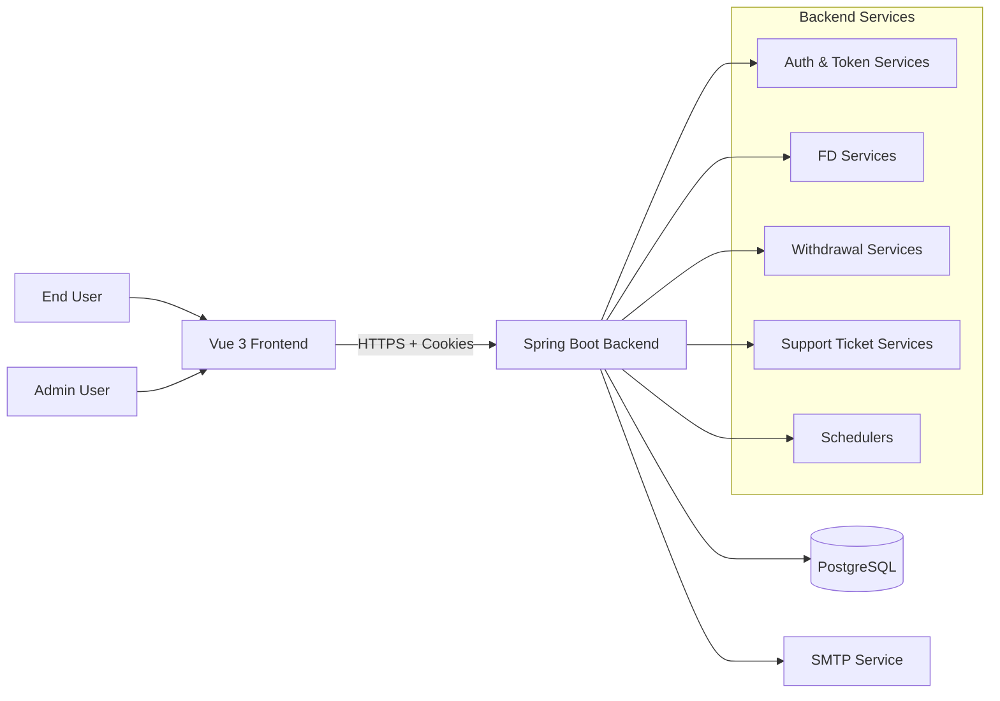
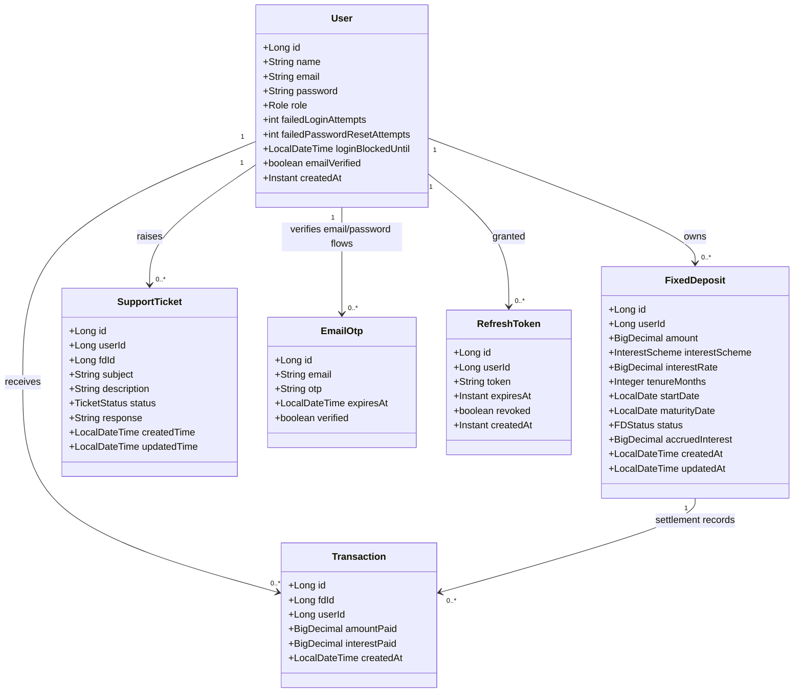
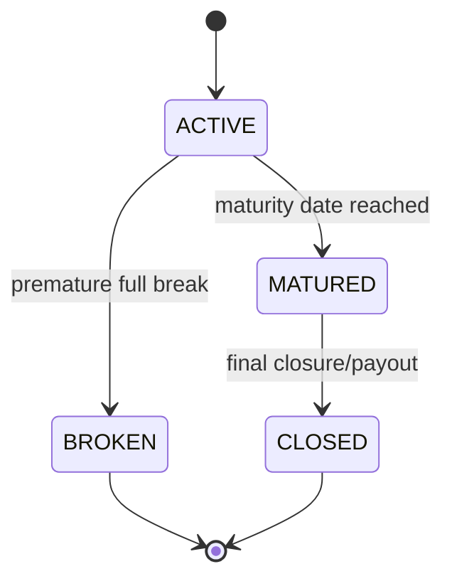
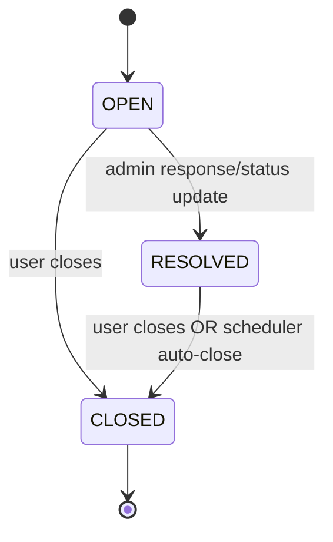
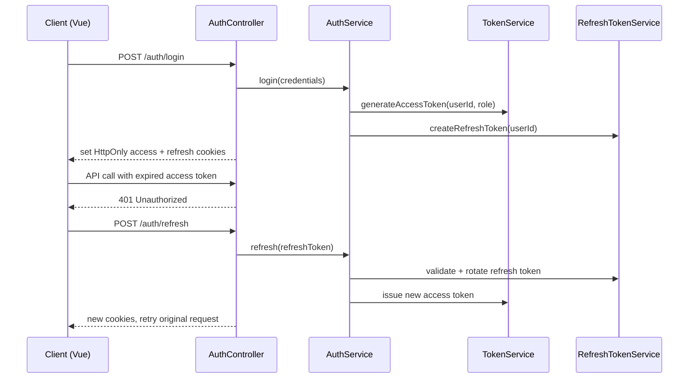
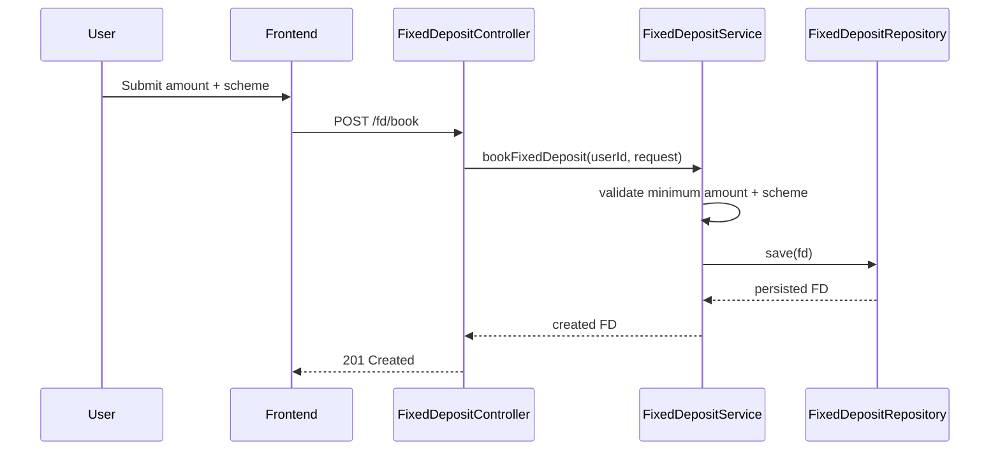
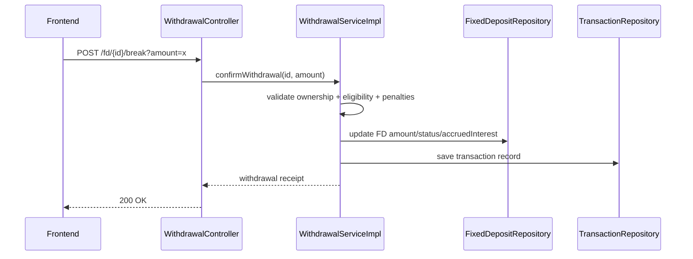

# Digital Fixed Deposit System — Project Report

**Document Version:** 1.0  
**Prepared On:** 15 February 2026  
**Project Type:** Full-stack financial web platform (FD booking, management, withdrawal, and support)

---

## Table of Contents
1. Executive Summary  
2. Project Scope & Objectives  
3. System Architecture Overview  
4. Backend Architecture (Spring Boot)  
5. Frontend Architecture (Vue 3 + TypeScript)  
6. Domain Model & Class Diagram (UML)  
7. Core Business Workflows (UML Sequence/State)  
8. API Design Summary  
9. Data Design  
10. Security Design  
11. Testing & Quality Engineering  
12. Deployment & Operations  
13. Risks, Gaps, and Recommendations  
14. Future Enhancements  
15. Conclusion

---

## 1) Executive Summary

The **Digital Fixed Deposit System** is a role-based banking-style application for managing fixed deposits digitally. It supports:
- User onboarding with OTP-based email verification
- JWT authentication with refresh-token rotation
- FD booking, tracking, maturity monitoring, and interest analytics
- Premature/full withdrawal with business-rule validation and penalty logic
- Admin operations for FD lifecycle supervision
- Ticket-based customer support with role-based transitions

The platform is implemented as:
- **Backend:** Spring Boot + Spring Security + JPA + PostgreSQL
- **Frontend:** Vue 3 + TypeScript + Vuex + Vue Router + Axios
- **Testing:** JUnit/Mockito + Vitest + Jest

---

## 2) Project Scope & Objectives

### 2.1 Business Goals
- Digitize fixed-deposit lifecycle operations
- Improve transparency with portfolio and interest analytics
- Enforce secure and auditable user/admin workflows
- Provide built-in support ticketing for issue resolution

### 2.2 Functional Scope
- Authentication & profile management
- FD scheme discovery and FD booking
- User and admin dashboards
- Interest timeline and financial-year analytics
- Withdrawal eligibility, preview, confirmation, and history
- Support ticket creation, response, and lifecycle transitions

### 2.3 Non-Functional Scope
- Secure, stateless API communication
- Role-based access control
- Maintainability through layered architecture
- Scheduler-driven automation for repetitive operations

---

## 3) System Architecture Overview

### 3.1 High-Level Component Diagram (UML)

### 3.2 Architectural Style
- **Client-Server model** with REST APIs
- **Layered backend architecture**: Controller → Service → Repository → Database
- **State-managed SPA frontend** with route guards and centralized store

---

## 4) Backend Architecture (Spring Boot)

### 4.1 Technology Stack
- Java 17
- Spring Boot (Web MVC, Security, Validation, Mail, Data JPA)
- PostgreSQL (runtime), H2 (tests)
- JWT (`jjwt`)
- Maven + JaCoCo

### 4.2 Package Organization
- `config` (security, CORS, password)
- `controller` (`auth`, `fd`, `withdrawal`, `support`, `admin`, `user`)
- `service` (business logic)
- `repository` (Spring Data JPA)
- `entity` (`user`, `fd`, `auth`, `transaction`, `support`)
- `dto` (request/response contracts)
- `exception` (custom exceptions + global handler)
- `util` (cookie/date/interest helpers)

### 4.3 Key Backend Modules

#### A) Authentication & User Management
- Registration guarded by verified OTP
- Login with lockout policy on repeated failures
- Refresh token rotation and logout revocation
- Profile read/update and password change/reset

#### B) Fixed Deposit Management
- FD scheme exposure (`/fd/schemes`)
- FD booking (`/fd/book`) with minimum amount validation
- User FD listing + filter by status and amount range
- Maturity forecast and yearly summary analytics
- Portfolio aggregation and interest timeline generation

#### C) Withdrawal Engine
- Eligibility check endpoint
- Break preview with penalty/business rules
- Confirmation flow with transaction recording
- Full/partial withdrawal handling and status updates

#### D) Support Ticketing
- User ticket creation with FD ownership check
- Admin-wide filtered ticket retrieval with specifications
- Role-aware status transitions
- Admin responses with auto resolve behavior

#### E) Scheduler Jobs
- OTP cleanup (every minute)
- FD maturity auto-marking (every minute)
- Support ticket auto-close of old resolved tickets (daily)

---

## 5) Frontend Architecture (Vue 3 + TypeScript)

### 5.1 Technology Stack
- Vue 3 + TypeScript
- Vue Router (role-aware route control)
- Vuex modular store (`auth`, `fd`, `support`)
- Axios client with interceptors and token refresh logic
- Vite build system

### 5.2 Frontend Layering
- `views`: page-level screens for public/user/admin flows
- `components`: reusable UI blocks (navbar, sidebars, notifications)
- `services`: API abstraction for each backend domain
- `store`: centralized state and async actions
- `types`: strongly typed domain contracts
- `utils/composables`: helper and UI behavior logic

### 5.3 Route Security Model
- Public routes: home, auth, legal pages
- User routes: dashboard, FD flows, support, profile
- Admin routes: dashboard, FD management, support operations
- Navigation guard behavior:
  - Fetch profile when required
  - Redirect guest-only routes when authenticated
  - Enforce role-based route access

---

## 6) Domain Model & Class Diagram (UML)

### 6.1 FD Status Lifecycle (UML State Diagram)

### 6.2 Support Ticket Lifecycle (UML State Diagram)

---

## 7) Core Business Workflows (UML Sequence/State)

### 7.1 Login + Token Refresh Flow

### 7.2 FD Booking Flow

### 7.3 Withdrawal Confirmation Flow

---

## 8) API Design Summary

### 8.1 Authentication APIs
- `POST /auth/email/send-otp`
- `POST /auth/email/verify-otp`
- `POST /auth/register`
- `POST /auth/login`
- `POST /auth/refresh`
- `POST /auth/logout`
- `POST /auth/password/send-otp`
- `POST /auth/password/reset`

### 8.2 User APIs
- `GET /user/profile`
- `PUT /user/profile`
- `PUT /user/profile/password`

### 8.3 FD APIs (User)
- `GET /fd/schemes` (public)
- `POST /fd/book`
- `GET /fd/user/{userId}`
- `GET /fd/user/{userId}/{fdId}`
- `GET /fd/user/{userId}/maturing`
- `GET /fd/user/{userId}/summary/financial-year`
- `GET /fd/user/{userId}/portfolio`
- `GET /fd/{fdId}/interest`
- `GET /fd/{fdId}/interest/timeline`

### 8.4 FD APIs (Admin)
- `PUT /admin/fd/{fdId}/status`
- `GET /admin/fd/maturing`
- `GET /admin/fd/summary/financial-year`
- `GET /admin/fd/yearly`
- `GET /admin/fd/all`
- `GET /admin/fd/user/{userId}/portfolio`
- `GET /admin/fd/{fdId}/interest/timeline`

### 8.5 Withdrawal APIs
- `GET /fd/{id}/break-preview`
- `POST /fd/{id}/break`
- `GET /fd/{id}/withdrawal-eligibility`
- `GET /fd/{userId}/withdrawals`

### 8.6 Support APIs
- `POST /support`
- `GET /support/my-tickets`
- `GET /support/{ticketId}`
- `PATCH /support/{ticketId}/status`
- `PATCH /support/{ticketId}/response`
- `GET /support` (admin filtered + paginated)

---

## 9) Data Design

### 9.1 Core Tables
- `users`
- `fixed_deposits`
- `fd_transaction`
- `support_ticket`
- `refresh_tokens`
- `email_otp`

### 9.2 Indexing Strategy (Observed)
- User email index
- FD user/status indexes
- Transaction user index
- Refresh token user/token indexes

### 9.3 Data Governance Notes
- Current entity mapping primarily uses `userId`/`fdId` scalar references
- Explicit DB foreign keys are not enforced at JPA relationship level in current model

---

## 10) Security Design

### 10.1 Implemented Controls
- JWT access tokens validated in custom security filter
- Role-based endpoint restrictions (`ADMIN` vs authenticated users)
- HTTP-only cookies for access/refresh tokens
- Refresh-token persistence, validation, and revocation
- OTP verification for registration and password reset
- Global exception handling with safe HTTP responses

### 10.2 Access Control Matrix (Summary)
- Public: auth onboarding + scheme discovery
- Authenticated: user/profile/FD/withdrawal/support personal operations
- Admin-only: `/admin/**` and admin support actions

### 10.3 Security Improvement Opportunities
- Move secrets from property files to environment/secret manager
- Set cookie `Secure=true` and strict `SameSite` in production
- Add rate limiting and brute-force controls at API gateway level
- Add audit trail enrichment for sensitive state transitions

---

## 11) Testing & Quality Engineering

### 11.1 Backend
- Extensive JUnit test suite covering:
  - Controllers
  - Services
  - Repositories
  - Entities/DTOs
  - Security config and handlers
- JaCoCo integrated for coverage reports (`backend/htmlReport`)

### 11.2 Frontend
- Dual test setup:
  - **Vitest** for unit tests (`tests/unit`)
  - **Jest** for service/store/component/view coverage (`tests/jest`)
- Coverage reporting configured in Vitest

### 11.3 Quality Practices
- Layered separation of concerns
- Typed DTOs and frontend models
- Reusable store/service abstractions

---

## 12) Deployment & Operations

### 12.1 Runtime Components
- Frontend served as Vite-built static SPA
- Backend Spring Boot application
- PostgreSQL instance
- SMTP provider for OTP emails

### 12.2 Build Commands (Typical)
- Backend: Maven build + test + JaCoCo report
- Frontend: Vite build and test scripts

### 12.3 Scheduler Operations
- Minute-level jobs for OTP cleanup and FD maturity
- Daily support-ticket auto-close process

---

## 13) Risks, Gaps, and Recommendations

### 13.1 Current Risks
1. **Credential exposure risk:** sensitive values in application properties
2. **Model integrity risk:** scalar IDs instead of stronger ORM relations
3. **Operational risk:** limited centralized observability/metrics in current setup
4. **API consistency risk:** some payload/response contracts vary across services

### 13.2 Recommended Actions
- Externalize secrets (`ENV`, Vault, cloud secret manager)
- Enforce DB foreign keys and add migration strategy (Flyway/Liquibase)
- Introduce OpenAPI/Swagger contract documentation
- Add structured audit logging and correlation IDs
- Standardize API response envelope

---

## 14) Future Enhancements

- Multi-factor authentication for high-value operations
- Event-driven notifications (email/SMS/in-app)
- Enhanced analytics dashboards and export features
- Multi-tenant readiness and tenant-aware data isolation
- Observability stack (metrics, tracing, centralized logs)

---

## 15) Conclusion

The Digital Fixed Deposit System demonstrates a strong foundation for a production-grade financial workflow platform:
- Clear role-based separation
- Well-defined FD lifecycle and support lifecycle
- Strong modularization across backend and frontend
- Significant testing coverage across layers

With focused improvements in secrets management, contract standardization, and operational observability, the system can be elevated to enterprise-grade deployment readiness.

---

## Appendix A — Suggested Documentation Extensions
- API reference with request/response examples
- ER diagram generated from live schema
- Deployment architecture per environment (dev/stage/prod)
- Runbook for incident response and scheduler failures

## Appendix B — PlantUML Source Files
- [docs/system-architecture.puml](docs/system-architecture.puml)
- [docs/domain-class-diagram.puml](docs/domain-class-diagram.puml)
- [docs/auth-flow-sequence.puml](docs/auth-flow-sequence.puml)
- [docs/fd-lifecycle-state.puml](docs/fd-lifecycle-state.puml)
- [docs/support-ticket-lifecycle-state.puml](docs/support-ticket-lifecycle-state.puml)
